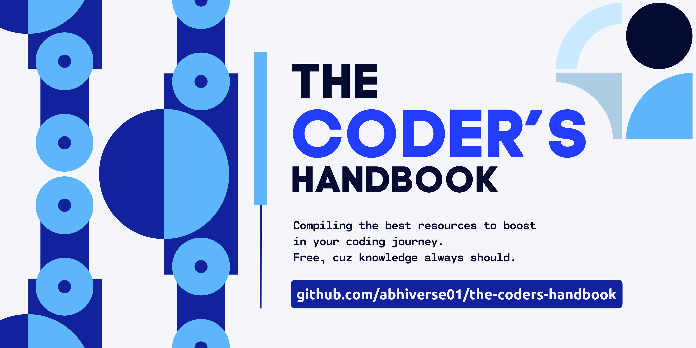

#

# The Coder's Handbook

This repo contains the list of all the valuable resources, links, notes, and important collections that I utilized and collected throughout my developer journey. Keeping it open source, if anybody ever feels the guide for it.

## Table of Contents
- [Introduction](#introduction)
- [Becoming an Expert Coder](#becoming-an-expert-coder)
  - [Foundations of Programming](#foundations-of-programming)
  - [Advanced Programming Concepts](#advanced-programming-concepts)
  - [Data Structures and Algorithms](#data-structures-and-algorithms)
  - [Software Development Practices](#software-development-practices)
  - [Working with APIs and Databases](#working-with-apis-and-databases)
  - [Web Development Essentials](#web-development-essentials)
  - [DevOps and CI/CD](#devops-and-cicd)
  - [Coding for Performance](#coding-for-performance)
  - [Real-World Application Development](#real-world-application-development)
  - [Soft Skills for Coders](#soft-skills-for-coders)
  - [Career Growth and Professional Development](#career-growth-and-professional-development)
- [Courses](#courses)
- [Emotional Intelligence in Coding](#emotional-intelligence-in-coding)
- [Python](#python)
  - [Functions in Python](#functions-in-python)
- [Restful APIs](#restful-apis)
- [Algorithms](#algorithms)
  - [Mastering Algorithms with Real-World Analogies](#mastering-algorithms-with-real-world-analogies)
- [Docker - 101](#docker-101)
- [Documentation](#documentation)
- [Good Git Repos](#good-git-repos)
- [Good Links](#good-links)
  - [Links and Blogs for R&D](#links-and-blogs-for-rd)
- [Handy Tools](#handy-tools)
- [Information](#information)
  - [Facts and Information](#facts-and-information)
- [Know Your Git](#know-your-git)
  - [Git Commands](#git-commands)
- [Motivation to Code](#motivation-to-code)
- [Notes](#notes)
  - [Approaches to AI](#approaches-to-ai)
- [Pipeline/TFX](#pipeline-tfx)
  - [TFX Extensions](#tfx-extensions)
- [Resources](#resources)
  - [Links](#links)
- [The Dot(.) Files](#the-dot-files)
- [Contribution](#contribution)
- [License](#license)
- [Contact](#contact)

## Introduction
A comprehensive collection of resources, links, notes, and important collections gathered throughout my developer journey. This repository is open-source and available for anyone who may find it helpful.

## Becoming an Expert Coder
An in-depth guide to mastering coding, covering everything from foundational programming to advanced development practices and professional growth.

## Notes

### Development Notes
A collection of valuable development notes covering various topics and technologies.

### Project Go-Through Notes
Detailed notes and walkthroughs of different projects I've worked on, explaining key concepts and implementations.

## Resources

### Courses
Links to valuable and open-source courses that provide in-depth knowledge on various programming and technology topics.

### Videos
A curated list of educational videos and tutorials to help enhance your learning experience.

### Articles
A collection of insightful articles and blog posts that cover a wide range of topics related to development.

### Tools and Software
Recommendations and links to useful tools and software that can aid in development and productivity.

## Contribution
Contributions are welcome! If you have valuable resources to add, please feel free to open an issue or submit a pull request.

## License
This project is licensed under the MIT License.

## Contact
If you have any questions or suggestions, please feel free to reach out.

#

<strong> Abhishek Shah | The Coder's Handbook | 2025 </strong>

#

